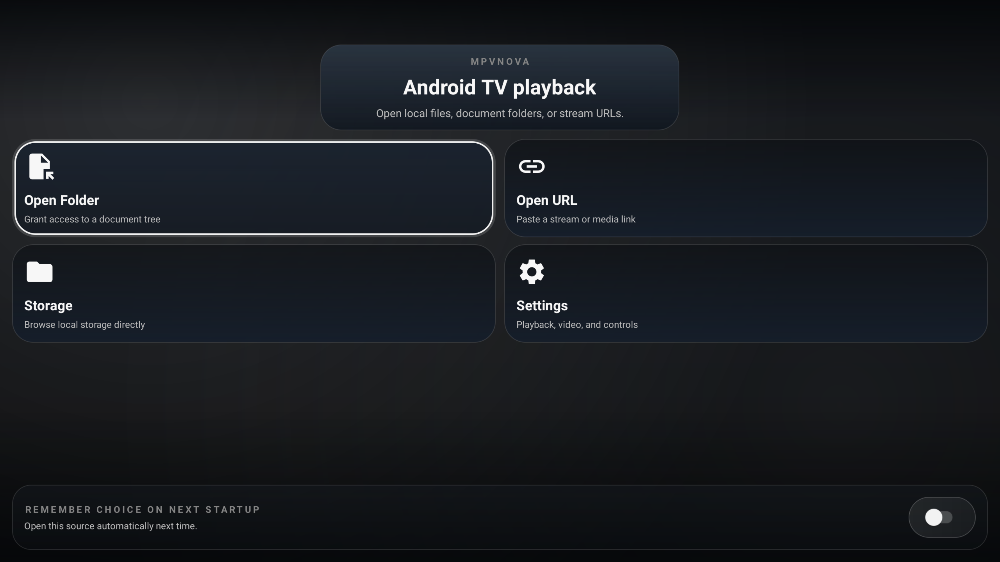
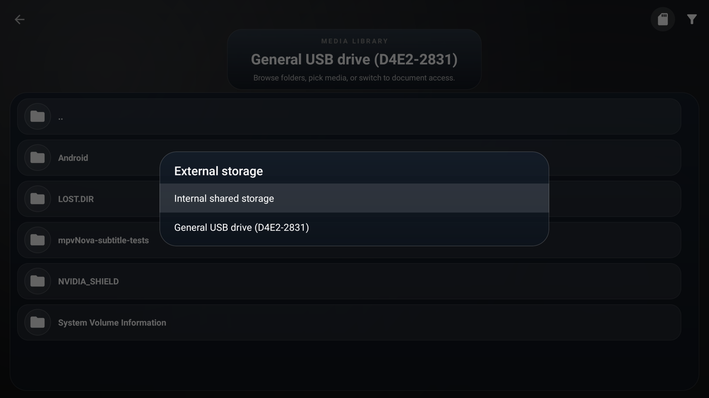
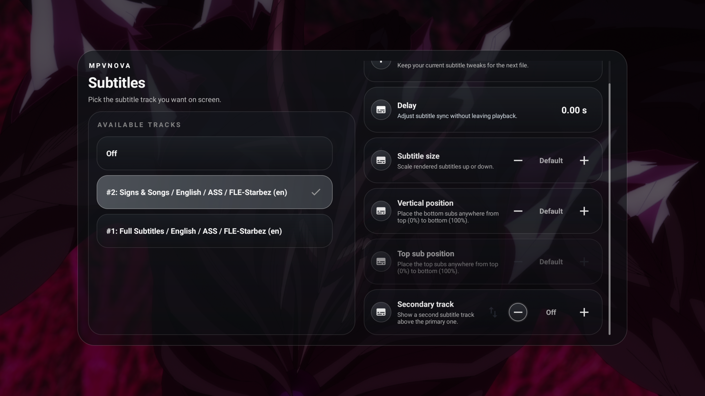
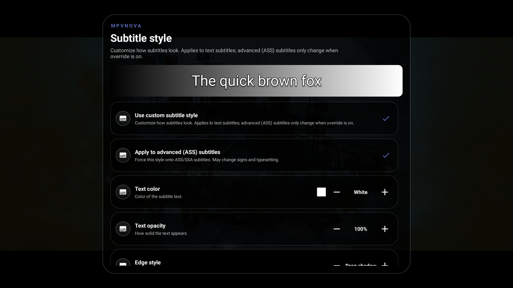
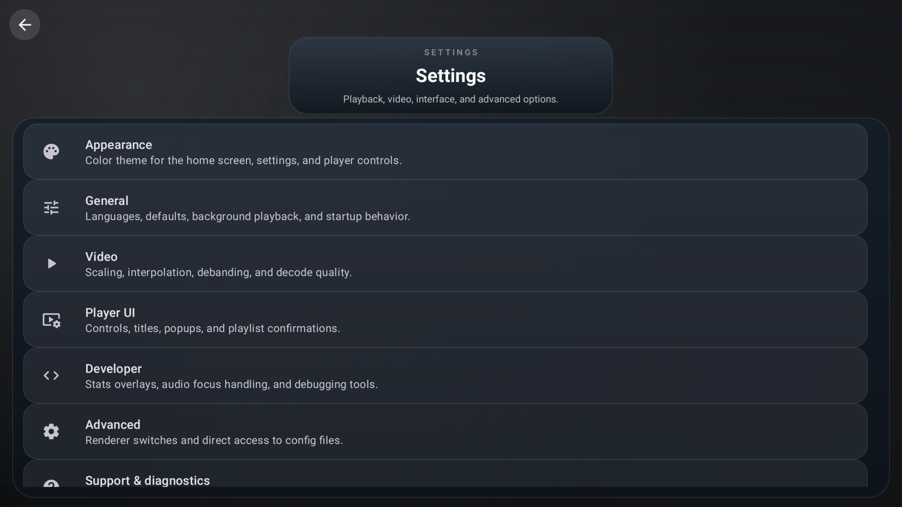
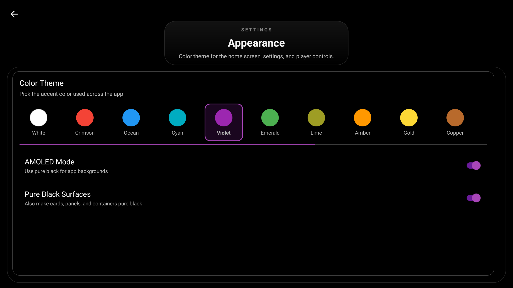
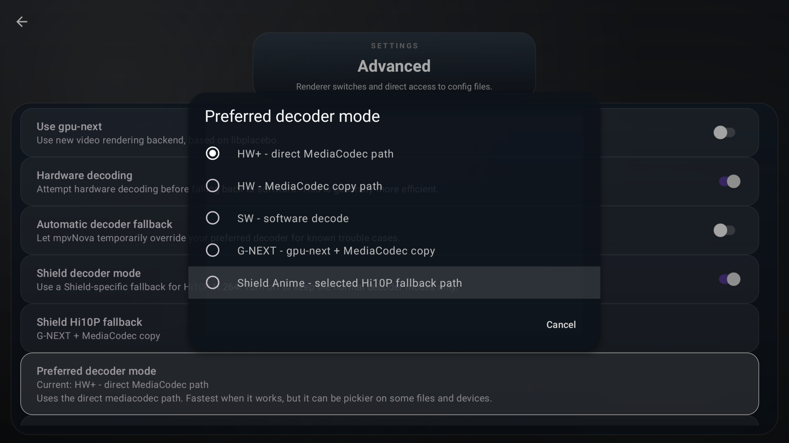

<div align="center">
  
</div>

# mpvNova
[](https://github.com/Laskco/mpvNova/releases/latest)
[](https://github.com/Laskco/mpvNova/releases/latest)
[](https://github.com/Laskco/mpvNova/actions/workflows/build.yml)
[](https://github.com/Laskco/mpvNova/actions/workflows/quality.yml)
[](https://ko-fi.com/laskco)
[](https://buymeacoffee.com/laskco)
[](https://www.paypal.com/donate/?hosted_button_id=R87TNQANCT8KN)

**mpvNova is an Android TV-first fork of [mpv-android](https://github.com/mpv-android/mpv-android), built on [libmpv](https://github.com/mpv-player/mpv). It keeps mpv's playback core while reshaping the app around couch-friendly navigation, a custom TV shell, and fast access to the controls that matter during playback.**

The goal is simple: keep mpv powerful, but make it feel natural on a TV from the moment it opens.

- TV-first home screen and launcher integration
- Remote-friendly player HUD with strong D-pad focus behavior
- Custom subtitle, audio, chapter, decoder, video-adjustment, advanced playback, and settings panels
- Smart subtitle matching for binge-watching, tied to persisted subtitle settings
- 16 built-in color themes, AMOLED mode, and pure black surfaces
- Dialogue-focused audio tools for stereo and surround playback
- Device-aware decoder paths including gpu-next and optional Shield Hi10P fallback handling
- In-app update checks backed by GitHub releases
- Leanback launcher support and TV banner assets
- Built for sideloading on Android TV, Google TV, and Android-based Fire OS TV devices

For the inherited playback feature set, scripting support, and core behavior that mpvNova builds on top of, see upstream [mpv-android](https://github.com/mpv-android/mpv-android).

---

## TV Devices Only

mpvNova is built for Android TV, Google TV, and Android-based Amazon Fire TV / Fire TV Stick devices running Fire OS. Android phones and tablets are out of scope, and mobile UI support will not be added.

Newer Vega OS Fire TV sticks are a different non-Android target. mpvNova's APK builds support Fire OS devices, not Vega OS devices that do not install Android APKs.

Fire OS support is best-effort. Fire OS is not an official upstream mpv / mpv-android target, so device-specific playback, decoder, MediaCodec, graphics driver, or native library bugs usually need fixes in upstream mpv/mpv-android, FFmpeg, libplacebo, Android's media stack, or device firmware. mpvNova can ship app-level compatibility fixes and safe defaults, but it cannot directly fix Fire OS playback issues that live in the upstream playback stack or vendor platform.

For mobile-focused Android mpv options, use projects such as [mpvEx](https://github.com/marlboro-advance/mpvEx) or [mpvKt](https://github.com/abdallahmehiz/mpvKt).

---

## Showcase
<div align="center">
  
</div>

<div align="center">
  
</div>

<div align="center">
  
</div>

<div align="center">
  
</div>

<div align="center">
  
</div>

<div align="center">
  
</div>

<div align="center">
  
</div>

<div align="center">
  
</div>

<div align="center">
  
</div>

<div align="center">
  
</div>

<div align="center">
  
</div>

<div align="center">
  
</div>

---

## Installation

Download the latest APK from the [GitHub releases page](https://github.com/Laskco/mpvNova/releases).

[](https://github.com/Laskco/mpvNova/releases/latest)

- Use the **universal** APK if you want one build that works across device architectures
- Use an ABI-specific APK only if you already know the target device architecture
- On Android-based Fire TV / Fire TV Stick devices, use the **universal** APK or the `armeabi-v7a` APK for most stick models
- After installation, future releases can also be checked from **Settings > App updates**

---

## What mpvNova Adds

mpvNova inherits mpv-android's playback foundation: hardware/software decoding, libass subtitles, dual subtitles, advanced rendering settings, URL playback, background playback, Picture-in-Picture, and keyboard input. The additions below are the TV-focused layer built for this fork.

- Android TV, Google TV, and Fire OS launcher support with leanback entry points, TV banner assets, and a couch-first home screen
- Redesigned player HUD with stronger D-pad focus, chapter markers, title display, TV-scale timing, and a compact chapter picker
- Single-click chapter skipping, with remote/D-pad hold opening the chapter picker after a fixed delay
- Custom subtitle panel with dual-track display, quick primary/secondary swap, independent position, size, delay, and secondary subtitle controls
- Smart subtitle memory: when **Persist subtitle settings** is enabled, mpvNova remembers a manually selected subtitle track and matches the closest language/title on the next file
- Audio panel with Voice Boost, Volume Boost, DRC, Audio Normalization, Channel Downmix, surround-state feedback, and filter persistence
- In-player decoder picker with `HW+`, `HW`, `SW`, `G-NEXT`, and optional `Shield Anime (Hi10P)` modes
- Advanced decoder settings for hardware decoding, automatic fallback, and Shield Hi10P fallback behavior
- Shield Hi10P fallback always software-decodes (no hardware can decode Hi10P) and offers two flavors: the default `G-NEXT SW — no tuning` (strictly stock playback) or `G-NEXT SW — light tuning` (loop-filter skip on non-reference frames, 1 s audio buffer, Lanczos-sharp upscaling)
- Player UI autopause options: a general "Pause when controls show" toggle, plus a Shield-specific "Pause Hi10P on Shield" toggle (on by default) that pauses playback while the controls overlay is visible so the SW decoder is not competing with the UI for CPU on Hi10P files
- Player-side video adjustment panels for brightness, contrast, gamma, and saturation, with optional remembered values
- Live `G-NEXT` path display for direct, copy, or software-backed playback paths, plus automatic decoder fallback for known trouble cases
- Appearance themes for White, Crimson, Ocean, Cyan, Violet, Emerald, Lime, Amber, Gold, Copper, Indigo, Rose, Slate, Chrome, Oyster, and Ivory, plus AMOLED mode and pure black surfaces
- Settings pages update the hero title to the active section, including Appearance, General, Video, Player UI, Advanced, and Support
- Home-screen update prompt, manual update checks, APK handoff to Android's installer, and release-note history from Settings
- Resume-position handling, media-title cleanup for launcher/stream sources, readable stats overlays, and support/debug export tools

---

## Building

### Prerequisites

- JDK 21
- Android SDK with current build tools
- Git for version information in builds
- Gradle wrapper `9.5.1`
- Android Gradle Plugin `9.2.0`
- Kotlin `2.3.21`

### App-only build

Use this when the bundled native libraries are already present and you mainly want to build or test the Android app layer.

**Windows**

```powershell
cmd /c gradlew.bat :app:assembleDefaultDebug
```

**Linux / macOS**

```bash
./gradlew :app:assembleDefaultDebug
```

### Full native rebuild

Use this when you need to rebuild `libmpv`, FFmpeg, or the JNI/native layer.

The native rebuild flow lives in [buildscripts/README.md](buildscripts/README.md). It is supported on Linux and macOS and is not intended to run natively on Windows.

Native rebuilds are only needed when updating or changing bundled native components such as mpv, FFmpeg, libass, or related JNI code. Regular Android UI work can use the app-only Gradle build.

### APK Variants

The Gradle config currently builds:

- `universal`: all bundled ABIs in one APK
- `arm64-v8a`
- `armeabi-v7a`
- `x86`
- `x86_64`

There is also an `api29` flavor for older-target compatibility builds.

For Amazon Appstore or Fire OS distribution, use the default flavor because it targets the current SDK while keeping `minSdk` low enough for older Android-based Fire TV devices.

---

## Releases

### Release signing

Release signing is optional for local debug builds, but required for signed release APKs.

- Keep your real signing files in `keystore.properties` and `keystore/`
- Start from [keystore.properties.example](keystore.properties.example) for the local file shape
- In CI or other non-local environments, use `MPVNOVA_STORE_FILE`, `MPVNOVA_STORE_PASSWORD`, `MPVNOVA_KEY_ALIAS`, and `MPVNOVA_KEY_PASSWORD`

### App updates

mpvNova checks GitHub releases from the home screen and from **Settings > App updates**. Update prompts are intentionally kept out of active playback so a release dialog never appears over the player UI.

The updater chooses the best APK asset for the device ABI when possible, opens Android's installer with a `FileProvider` URI, and cleans cached update APKs after the newly installed version relaunches.

---

## Official Builds And Branding

Official mpvNova builds are distributed through this repository's [GitHub Releases](https://github.com/Laskco/mpvNova/releases).

The `mpvNova` name, app icon, TV banner, package name `app.mpvnova.player`, release assets, and built-in update endpoint are reserved for official builds. Forks and redistributed builds must use their own app name, package name, signing key, artwork, and update source.

Do not upload mpvNova-branded builds to app stores or third-party stores without permission.

---

## Privacy

The project privacy policy is available at [docs/privacy.html](docs/privacy.html).

---

## Acknowledgments

- [mpv-android](https://github.com/mpv-android/mpv-android)
- [mpv](https://github.com/mpv-player/mpv)
- everyone whose work made the upstream Android port and playback stack possible
